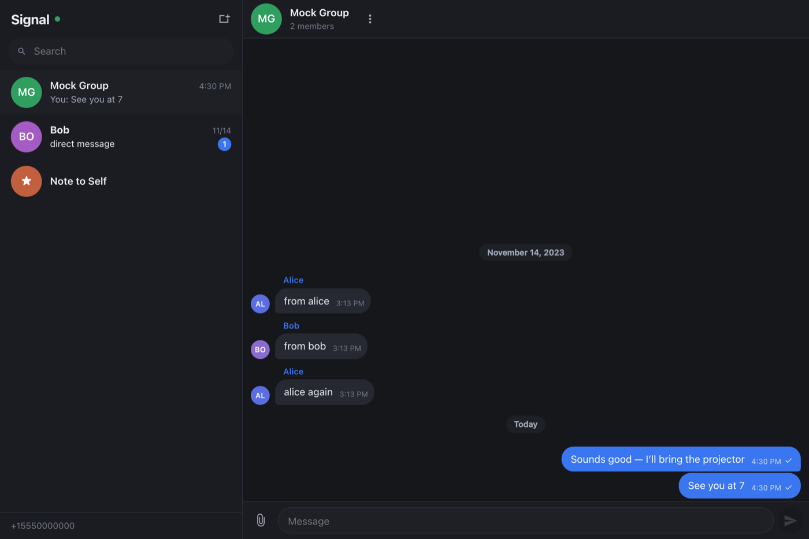

# Signal Web Client

A browser-friendly Signal messenger you can use from a phone or laptop. It talks
to an existing [signal-cli-rest-api](https://github.com/bbernhard/signal-cli-rest-api)
instance that is already linked to your account, keeps its own message history,
and pushes new messages to open browsers over a WebSocket.



- Send and receive messages, photos, video, voice notes and files
- Group chats, replies/quotes, emoji reactions, typing indicators, read receipts
- Unsend ("delete for everyone") your own messages, or hide them locally
- Create groups, leave them, mute or delete conversations from the thread menu
- Message edits, remote deletes and disappearing-message notices are honoured
- Installs to a phone home screen (PWA) with desktop notifications
- Dark and light themes, single-pane on phones and two-pane on desktop
- Optional password gate, with a signed-in device list you can revoke from

## Quick start

```bash
cp .env.example .env       # point SIGNAL_API_URL at your instance, set AUTH_PASSWORD
npm install
npm start                  # http://localhost:8080
```

Node 26+ is required. Storage uses the built-in `node:sqlite`, which is stable
as of Node 26 (it was experimental, and warned on every start, through Node 24).
There is no frontend build step — the browser loads the ES modules in `public/`
directly.

## Docker

```bash
docker compose up -d --build
```

Then open `http://<host>:8080`. Configuration comes from the environment:

```bash
docker run -d --name signal-web-client -p 8080:8080 \
  -e SIGNAL_API_URL=http://10.0.1.197:8095 \
  -e AUTH_PASSWORD=change-me \
  -v signal-web-data:/data \
  signal-web-client
```

The SQLite database and cached media live in `/data`, so mount a volume there to
keep your history across upgrades.

`docker-compose.yml` also contains a commented-out `signal-cli-rest-api` service
if you'd rather run the whole stack together.

The published image runs on Chainguard's minimal, non-root Node base, which is
maintained at zero known CVEs and ships no shell-accessible package manager.
Because its free tier publishes only a moving `:latest`, CI boots the built
image and exercises `node:sqlite` and the HTTP surface before publishing, so a
breaking base-image bump fails the build rather than the deployment
(`scripts/smoke-test.sh`, runnable locally against any tag).

### Prebuilt images (NAS, Portainer, anywhere)

Every push to `main` publishes a multi-architecture image to GitHub Container
Registry, so a NAS can pull it without building anything:

```
ghcr.io/mccahan/signal-web-client:latest
```

`linux/amd64` (Synology x86, most QNAP, Intel NUC) and `linux/arm64` (ARM
Synology models, Raspberry Pi) are both included; Docker picks the right one.
Tags: `latest` from `main`, `sha-<short>` per commit, and `1.2.3` / `1.2` when
you push a `v*` git tag.

**The package is private until you make it public.** After the first successful
workflow run, open the package page → *Package settings* → *Change visibility* →
**Public**. Without this the NAS gets `denied` / `unauthorized` on pull, and
would need a personal access token with `read:packages` instead.

`docker-compose.nas.yml` is a pull-only compose file you can paste straight into
Synology Container Manager or Portainer:

```bash
docker compose -f docker-compose.nas.yml up -d
```

Or by hand:

```bash
docker run -d --name signal-web-client --restart unless-stopped \
  -p 8080:8080 \
  -e SIGNAL_API_URL=http://10.0.1.197:8095 \
  -e AUTH_PASSWORD=change-me \
  -v signal-web-data:/data \
  ghcr.io/mccahan/signal-web-client:latest
```

Keep `/data` on a volume — it holds the message history, cached media and
backups, and the history cannot be re-fetched from Signal if you lose it.

## Configuration

| Variable | Default | Purpose |
| --- | --- | --- |
| `SIGNAL_API_URL` | `http://10.0.1.197:8095` | Your signal-cli-rest-api base URL |
| `SIGNAL_NUMBER` | *(auto)* | Account to drive; auto-detected from `/v1/accounts` |
| `PORT` / `HOST` | `8080` / `0.0.0.0` | Where this server listens |
| `DATA_DIR` | `./data` | Database and cached media |
| `AUTH_PASSWORD` | *(none)* | Shared password. Blank disables the login screen |
| `SECURE_COOKIE` | `false` | Set `true` when served over HTTPS |
| `SESSION_SECRET` | *(generated)* | Only needed to share sessions across replicas |
| `SESSION_DAYS` | `30` | How long a login stays valid |
| `SESSION_IDLE_DAYS` | `14` | Prune logins unused this long (`0` disables) |
| `SEND_READ_RECEIPTS` | `true` | Tell senders when you open a conversation |
| `SEND_TYPING_INDICATORS` | `true` | Broadcast your typing state |
| `RECEIVE_TIMEOUT` | `1` | Poll window while a browser is connected (seconds) |
| `IDLE_RECEIVE_TIMEOUT` | `5` | Poll window when nobody is connected |
| `MAX_UPLOAD_BYTES` | `104857600` | Outgoing attachment cap |
| `BACKUP_ENABLED` | `true` | Periodic database snapshots |
| `BACKUP_INTERVAL_HOURS` | `6` | How often to snapshot |
| `BACKUP_KEEP` | `7` | Snapshots to retain |
| `BACKUP_DIR` | `<DATA_DIR>/backups` | Where snapshots are written |
| `LOG_LEVEL` | `info` | `error`, `warn`, `info`, `debug` |

## How it works

```
browser ──WebSocket──┐
browser ──REST────── │ ──▶ signal-web-client ──▶ signal-cli-rest-api ──▶ Signal
                     │            │
                     └── events ──┴── SQLite (history) + cached media
```

Two things about the upstream API drove the design:

**Receiving is destructive.** `GET /v1/receive` hands each message over exactly
once; nothing is stored server-side. This app therefore keeps its own SQLite
history and is the sole consumer of that queue.

**Every operation serialises per account.** signal-cli holds one lock per
account, so a long-poll `receive` blocks an outgoing `send` for the whole poll.
Measured on the reference instance: a 20-second poll delayed a send by **22.7s**.

So all upstream traffic goes through a single priority lane
(`server/signal-api.js`): sends, reactions and receipts preempt the receive
loop, and the poll window is kept short. That brings send latency down to about
**3 seconds** — one poll cycle, most of which is signal-cli's ~2s startup cost.

### Make it faster: run the API in `json-rpc` mode

If you set `MODE=json-rpc` on the signal-cli-rest-api container, signal-cli stays
resident instead of being spawned per request. `/v1/receive` then becomes a live
WebSocket stream, messages arrive instantly, and the send contention disappears.

**This client detects the mode at startup and switches to the streaming path on
its own** — no configuration needed. It falls back to polling if the stream
can't be established.

## Operational notes

- **Run only one instance per account.** Because `receive` consumes messages,
  two instances polling the same account will split the message stream between
  their databases, and each will be missing whatever the other got.
- **Put it behind a password.** Anyone who can reach the port can read and send
  your messages. Set `AUTH_PASSWORD`, and use HTTPS (plus `SECURE_COOKIE=true`)
  if it's reachable from outside your LAN.
- **Sessions are revocable.** Each login gets a row in the database and the
  cookie carries only its id, so "Devices" in the sidebar footer can sign out a
  single device — including closing its open WebSocket, since authentication is
  otherwise only checked when the socket is opened. Expired, idle and
  long-revoked rows are pruned every six hours.
- **Notifications and home-screen install need a secure context.** Browsers only
  allow them on `https://` or `http://localhost`. Over plain HTTP to a LAN IP
  the app still works, but notifications won't fire — put it behind a TLS
  reverse proxy if you want them on your phone.
- **Two kinds of message delete.** "Delete for everyone" retracts the message on
  the recipients' devices via `DELETE /v1/remote-delete` — your own messages
  only, and subject to Signal's retention window. "Delete for me" just hides it
  in this client's database. Deletes that *other* people send are applied
  normally.
- **Deleting a conversation is local, and reversible by the sender.** It erases
  the history here and hides the thread; if that person messages you again the
  thread comes back, so nothing arrives silently. Deleting a group you're still
  in leaves it first. Note that signal-cli keeps listing groups even after
  `DELETE /v1/groups` succeeds, which is why the thread is hidden rather than
  dropped — otherwise the next roster sync would recreate it.
- **Back up the snapshots, not the live database.** `data/signal-web.db` runs
  in WAL mode: copying it alone misses whatever is still in `-wal`, and a copy
  taken mid-checkpoint can be torn. The app writes a consistent, self-contained
  snapshot to `data/backups/` every few hours and keeps `latest.db` pointing at
  the newest one, so point your backup job at that directory (or just
  `latest.db`) and it will never read a locked or partial file. Snapshots are
  written under a temporary name and renamed into place, and each is
  integrity-checked before it is published. `POST /api/backups` takes one
  immediately; `GET /api/backups` reports the last result.
- **History starts when this app does.** It can only store what it receives from
  the moment it first runs; there's no backfill of older Signal history.

## Project layout

```
server/
  index.js       HTTP + WebSocket server, boot sequence
  signal-api.js  upstream client and the single priority lane
  receiver.js    receive loop (polling) or live stream (json-rpc)
  ingest.js      envelope -> conversations, messages, receipts, reactions
  store.js       SQLite domain layer and identity resolution
  outbound.js    sending, reactions, read receipts, typing
  routes/api.js  REST API and the media/avatar proxy
  backup.js      periodic consistent SQLite snapshots
  sessions.js    revocable browser logins
public/
  js/app.js      UI: conversation list, thread, composer
  js/format.js   names, timestamps, mentions and rich-text rendering
  sw.js          service worker (shell only — never caches messages)
.github/workflows/
  docker-publish.yml   multi-arch image build -> ghcr.io
```

## Licence

MIT
